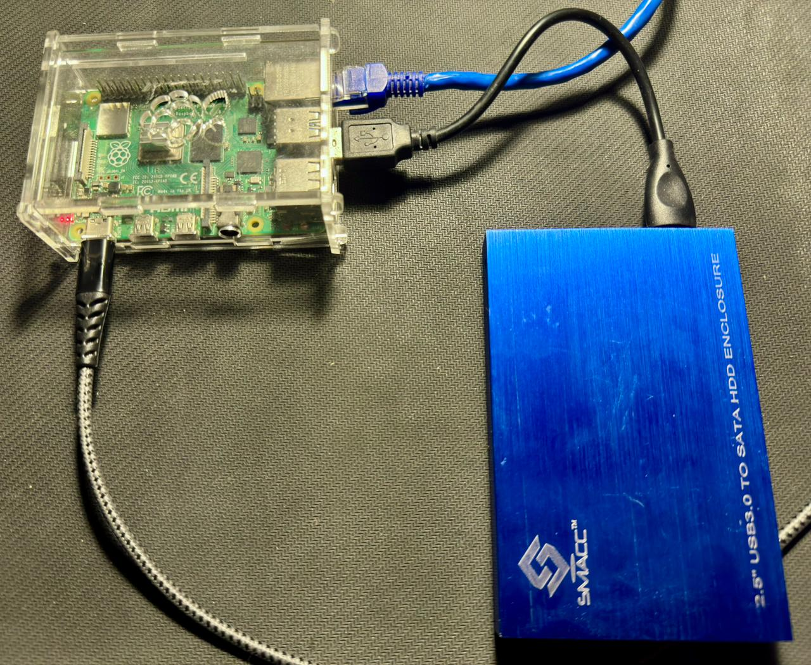
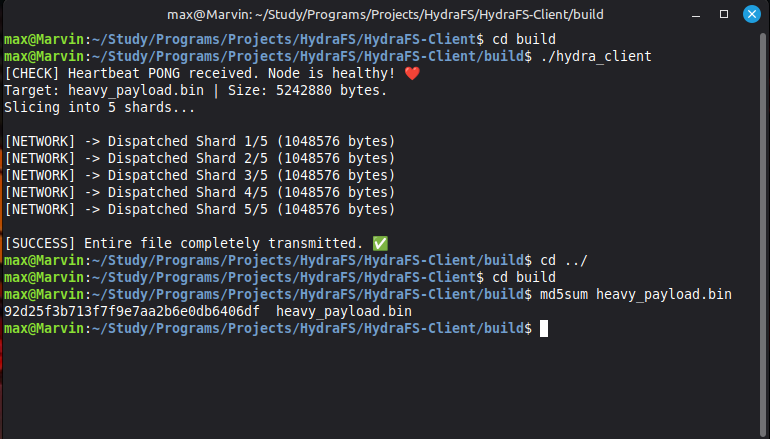
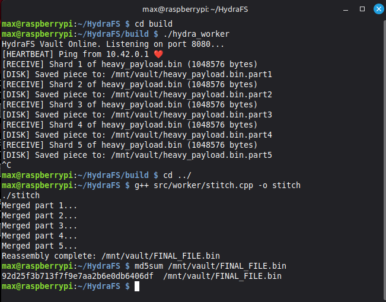

# HydraFS: Shard-Based Distributed Storage System 🐉

HydraFS is a high-performance, distributed filesystem designed to shard, transmit, and manage data across a network. Built with **C++17** and **Boost.Asio**, it slices heavy binary payloads into discrete shards on a client "Slicer" and persists them to a Raspberry Pi "Vault" backed by a 1TB external storage array.

---

## 🏗️ System Architecture

The project is organized as a monorepo containing both the transmitter and receiver logic:

* **[Client (The Slicer)](./client)**: Runs on the host machine (Linux Mint). Handles file slicing, health checks, and reliable transmission.
* **[Worker (The Vault)](./worker)**: Runs on the storage node (Raspberry Pi). Manages asynchronous packet handling, disk I/O, and data reassembly.
* **[Proto](./proto)**: The shared source-of-truth for Protocol Buffer definitions.

---

## 📸 System in Action

### 1. The Hardware Setup
The storage node is powered by a Raspberry Pi integrated with a 1TB external HDD, providing a low-power yet high-capacity vault for distributed shards.

---

### 2. Network Transmission (The Slicer)
The client engine performs a pre-flight health check before initiating a multi-shard transfer. It utilizes half-close TCP logic to ensure the stream is fully flushed before the worker begins disk persistence.

---

### 3. Vault Operations (The Worker)
The worker utilizes an asynchronous "Switchboard" logic to identify incoming packets. It distinguishes between Heartbeat PINGs and Shard data in real-time, logging successful disk writes to the `/mnt/vault/` mount point.

---

## 🛠️ Tech Stack & Key Concepts

* **Networking**: `Boost.Asio` for asynchronous I/O and non-blocking socket management.
* **Serialization**: `Google Protocol Buffers` (Protobuf) for language-agnostic binary data structures.
* **Data Integrity**: 100% fidelity verified via MD5 checksum comparisons between source and reassembled files.
* **Resilience**: Robust handling of `Broken Pipe` and `Connection Reset` errors to ensure worker uptime in unstable network environments.

---

## 🚦 Quick Start

* The client part was ran on a Laptop with linux mint operating system. The required steps are provided in the Readme file present in the client folder. The proto folder present int the root folder of the repo should be placed in the client as well as the worker folders before running the program.

* The worker part was ran on Raspberry pi 4 with Raspberry pi lite operating system. The required steps are provided in the Readme file present in the worker folder. The proto folder present int the root folder of the repo should be placed in the client as well as the worker folders before running the program.
